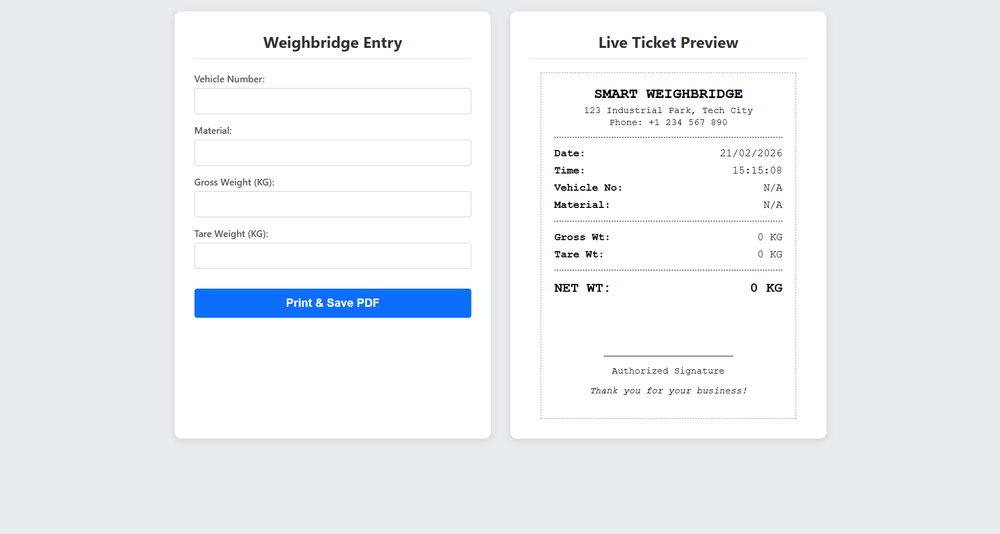

# WeighSmart 🎯

## Basic Details

### Team Name: CodeDuel

### Team Members
- Member 1: Soorya TV - College of Engineering Trikaripur
- Member 2: Anugraha Anoop - College of Engineering Trikaripur

### Hosted Project Link
[https://smartweighing.vercel.app/](https://smartweighing.vercel.app/)

### Project Description
WeighSmart is a smart, React-based web application that streamlines weighbridge operations by generating real-time, customizable, and printable weighbridge tickets with automated net weight calculations.

### The Problem statement
Manual weighbridge data entry is prone to errors, time-consuming, and lacks a digital, easily printable format for reliable record-keeping of vehicle and material weights.

### The Solution
WeighSmart provides a user-friendly digital interface to input vehicle weight details, instantly calculates net weight, and generates a formatted, print-ready ticket. With real-time preview and direct PDF saving capabilities via `react-to-print`, it ensures accuracy and efficiency at the weighbridge.

---

## Technical Details

### Technologies/Components Used

**For Software:**
- **Languages used:** JavaScript, HTML, CSS
- **Frameworks/Libraries used:** React, Vite, React-DOM, React-to-Print
- **Tools used:** VS Code, Node.js, npm

**For Hardware:**
- **Main components:** N/A (Software Project)

---

## Features

- **Real-Time Data Entry**: Instantly input Vehicle Registration Number, Material info, Gross Weight, and Tare Weight.
- **Automated Calculation**: Automatically calculates NET Weight by subtracting Tare from Gross Weight.
- **Live Ticket Preview**: See changes on the weighbridge ticket live as you compose the entries.
- **Export to PDF & Print**: Dedicated button to directly print the ticket or save it securely as a PDF file.

---

## Implementation

### For Software:

#### Installation
First, ensure you have Node.js installed. In your project directory, install the required dependencies:
```bash
npm install
```

#### Run
Start the development server:
```bash
npm run dev
```

---

## Project Documentation

### Screenshots


*(Screenshot showing the main UI layout encompassing the entry form and live ticket)*

### Workflow

**Application Workflow:**
1. The user inputs the vehicle information and the weights (Gross and Tare) into the web form.
2. The React states are dynamically updated, triggering an automatic recalculation of the Net Weight.
3. The right-hand panel instantly reflects the updated values on the Live Ticket Preview.
4. The user clicks **Print & Save PDF**, bringing up the system print dialog connected specifically to the generated ticket format for ease of record-keeping.

---

## Additional Documentation

*(N/A - This project is primarily a frontend React App running without a custom backend/API currently.)*

---

## Team Contributions

- **Soorya TV**: Frontend UI/UX, logic handling, state implementation.
- **Anugraha Anoop**: Form validations, layout design, and implementation of the React-to-Print logic.

---

## License

This project is licensed under the MIT License - see the [LICENSE](LICENSE) file for details.

---

Made with ❤️ at TinkerHub